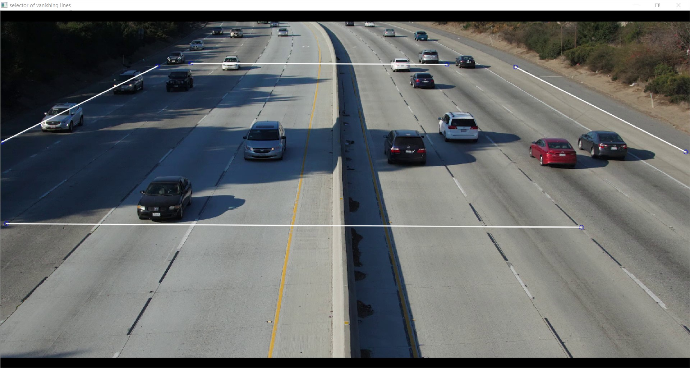

# 2_CAM_CAL

This is a C++ implementation of manual camera calibration with EDA optimization.

**With the access to GPS coordinates (using Google Maps or other tools), you can use our newly developed PnP-based calibration tool [here](https://github.com/zhengthomastang/Cal_PnP) instead.**

## Introduction

From each camera view, we first manually label two pairs of vanishing lines, i.e., parallel line pairs on the 3D ground plane that are orthogonal with each other, from which we can derive the two vanishing points on the ground plane, noted _V_X_ and _V_Y_. It has been proven that all the camera parameters in a 3×4 projection matrix **P** can be computed from _V_X_ and _V_Y_ with some constraints on intrinsic camera parameters. To relax these constraints for more accurate estimation of camera parameters, we formulate an optimization problem to minimize the reprojection error. A set of line segments on the ground plane, each defined by two endpoints, are manually selected, whose ground-truth 3D lengths are measured in the Google Maps. Using the calculated camera parameters, the 2D endpoints of the line segments can be back projected to 3D. Their Euclidean distances represent the estimated 3D lengths of the line segments. The absolute differences between estimations and ground truths are summed up to represent the reprojection error. Our objective is to minimize the reprojection error.

The non-linear optimization problem can be iteratively solved by the Estimation of Distribution Algorithm (EDA), which is a classic evolutionary algorithm. At the first iteration of EDA, an initial population of camera parameters, noted _R_, is generated by uniform distribution. Among _R_, a selected population, noted _N_, with the lowest estimated reprojection error is chosen to fit a probability density function (pdf) with eleven-variate normal distribution, as there are 11 camera parameters in **P** to be optimized. Then, we move on to the next iteration to generate a new initial population and select the optimum subset to estimate the pdf again. This iterative process stops until the mean of the estimated pdf is smaller than a specified threshold.

## Coding Structure

1. `./src/` folder: Source code
2. `./data/` folder: Example input and output files
   1. `cfg.json`: Configuration parameters in JSON format
   2. `frm.png`: Input frame image
   3. `camParam.txt`: Output camera parameters. 

## How to Build

1. Download and make the OpenCV library. A tutorial is given [here](https://docs.opencv.org/master/d7/d9f/tutorial_linux_install.html).
2. Compile using g++ in Linux environment. If you are new to g++ compilation with OpenCV, please refer to this [link](http://answers.opencv.org/question/25642/how-to-compile-basic-opencv-program-in-c-in-ubuntu/). In the command window, you can `cd` to the current directory and use the following command to compile our source code, where `bin` is the executable file generated. Note that you may need to add `sudo` at the beginning to grant the admin permission.

```g++ -I/usr/local/include/ -L/usr/local/lib/ -g -o bin ./src/main.cpp ./src/Cfg.cpp ./src/CamCal.cpp -lopencv_core -lopencv_imgproc -lopencv_highgui -lopencv_imgcodecs -lm```

## How to Use

1. Set the parameters in the configuration file if necessary. 
   1. The user needs to provide an approximate range (ideally 0.5 to 1 meter) of camera height in `calCamHeiMax` and `calCamHeiMin`.
   2. For manual calibration, if `calSelVanLnFlg` is not set, the user can manually input the 2D coordinates of two vanishing points Vr (on the right) and Vl (on the left) respectively in `calVr` and `calVl`. Otherwise, s/he can select two pairs of vanishing lines, i.e., parallel lines on the ground plane in 3D that are perpendicular to each other, in the window of “selector of vanishing lines”. Please select a pair of vanishing lines first and then another pair. There should be 8 points clicked in total. After the selection of vanishing lines is done, click `o`. Then, the window “3D grid on ground plane” will appear showing the update of calibration result. 
<div align="center">
    
</div>
<div align="center">
    
</div>
   3.	When `calEdaOptFlg` is set, the camera parameters will be optimized by the estimation of distribution algorithm (EDA) to minimize reprojection error. The user can input the end points of line segments and their true 3D distances respectively in `calMeasLnSegNdPt` and `calMeasLnSegDist`. 
2. Run the executable file.

```./bin```

### Output Format

For output camera parameters in text, the format is as follows:

\<K_0\> \<K_1\> \<K_2\> \<K_3\> \<K_4\> \<K_5\> \<K_6\> \<K_7\> \<K_8\>

\<R_0\> \<R_1\> \<R_2\> \<R_3\> \<R_4\> \<R_5\> \<R_6\> \<R_7\> \<R_8\>

\<t_0\> \<t_1\> \<t_2\>

\<P_0\> \<P_1\> \<P_2\> \<P_3\> \<P_4\> \<P_5\> \<P_6\> \<P_7\> \<P_8\> \<P_9\> \<P_10\> \<P_11\>

K, R, t and P respectively stand for the intrinsic camera matrix, the rotation matrix, the translation matrix and the projection matrix. In the 3D coordinate system, the ground plane is equivalent to the X-Y plane. The Z axis points upward and passes through the camera location. 

## Disclaimer

For any question you can contact [Zheng (Thomas) Tang](https://github.com/zhengthomastang).