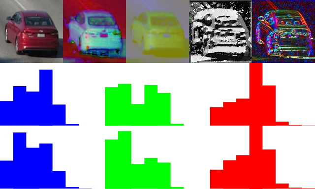

# 5_APP_MDL

This is a C++ implementation of the extraction of histogram-based adaptive appearance features and their comparison.

## Introduction

The appearance model of the j-th tracklet, noted _m_j_, contains a set of _n_m_ observed concatenated histogram vectors. In our experiments, we use a combination of RGB color histogram, HSV color histogram, Lab color histogram, Linear Binary Pattern (LBP) histogram and gradient histogram for feature description, i.e., there are 11 channels with 8 bins each. For each tracklet, we keep _n_m_ copies of continuously updated histograms to “memorize” variations of the appearance. The value in each bin is normalized between 0 and 1. An example of feature maps and the corresponding histograms is shown in the figure below. The first row respectively presents the RGB, HSV, Lab, LBP and gradient feature maps for an object instance in a tracklet, which are used to build feature histograms. The second row shows the original RGB color histograms and the third row demonstrates the Gaussian spatially weighted histograms, where the contribution of background area is suppressed. 

<div align="center">
    
</div>

To build and update this appearance model, each cropped object region within the detected bounding box is used to build histograms. When the observation is occluded by other(s), the occluded area is removed from the object region before our building the concatenated histograms of visual features. The pixel values for histogram construction are spatially weighted by Gaussian (kernel) distribution. The spatial weight is maximum around the center of mass where the object usually occupies, which should be emphasized in our feature description. As the spatial weight decreases when a pixel gets further from the center of mass, we can suppress the background area.

Since the object instances that are closer to the camera should enjoy more reliable appearance description, the learning rate of _m_j_ is inversely proportional to the depths of vehicles’ 3D foot points. For each tracklet, _n_m_ concatenated histogram vectors extracted from instances with the smallest depths are inserted into _m_j_. Any other encountered histogram vector can be randomly swapped with an existing element with a probability equal to the learning rate. 

The appearance change loss is equivalent to the ratio of histogram vectors from two appearance models that are mismatched. 

After a group of tracklets are associated in SCT, their appearance models are merged together based on depth information following similar update scheme. The merged appearance model is used to describe the appearance change along the entire vehicle trajectory, which will be employed in ICT.

## Coding Structure

`./src/` folder: Source code

## How to Build

1. Download and make the OpenCV library. A tutorial is given [here](https://docs.opencv.org/master/d7/d9f/tutorial_linux_install.html).
2. Compile using g++ in Linux environment. If you are new to g++ compilation with OpenCV, please refer to this [link](http://answers.opencv.org/question/25642/how-to-compile-basic-opencv-program-in-c-in-ubuntu/). In the command window, you can `cd` to the current directory and use the following command to compile our source code, where `bin` is the executable file generated. Note that you may need to add `sudo` at the beginning to grant the admin permission.

```g++ -I/usr/local/include/ -L/usr/local/lib/ -g -o bin ./src/main.cpp -lopencv_core -lopencv_imgproc -lopencv_highgui -lopencv_imgcodecs -lopencv_objdetect -lm```

## How to Use

1. Run the executable file. The weight for each component should be a floating number between 0 and 1, where smaller weight will suppress the corresponding component.

```./bin <input 3D tracking results> <input folder of frame images> <output folder of feature vectors> <weight for BGR component> <weight for HSV component> <weight for Lab component> <weight for LBP component> <weight for gradient component>```
	
2. To compare two adaptive appearance models, the user can use the given function `compAppMdl()`. The required input are the folder paths and IDs of the probe and the gallery. Different types of histogram comparison are provided, including EMD, correlation, chi-square, intersection and Bhattacharyya distance. The returned value is the distance normalized to 0-1 between two appearance models. 

## Disclaimer

For any question you can contact [Zheng (Thomas) Tang](https://github.com/zhengthomastang).


