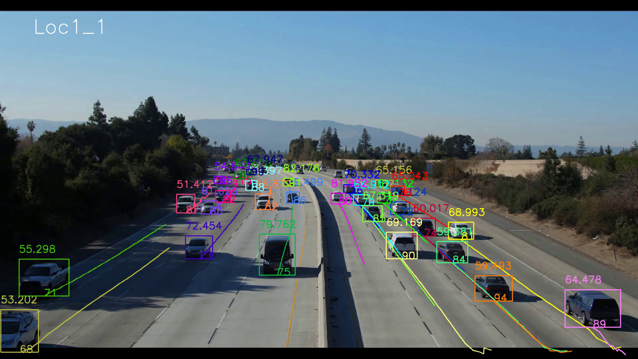

# 6_SPD_EST

This is a C++ implementation of 3D speed estimation based on input of 2D tracking results and camera parameters.

## Introduction

For each video, the projection matrix and the 2D tracking results at each frame are input to our algorithm. Each object foot point is back projected to the 3D space. The 3D speed is computed based on a sliding time window with smoothing. Since the precision of 3D estimation is negatively proportional to depth, we use the speed of instances close to the camera to propagate through each entire object trajectory, if the speed variance is smaller than a given threshold. For an object instance whose speed is too small, we assume that it is stopping. Finally, for the false negatives whose detection scores are too low, the speed of the closest true positives are applied to them. 

## Coding Structure

`./src/` folder: Source code

## How to Build

1. Download and make the OpenCV library. A tutorial is given [here](https://docs.opencv.org/master/d7/d9f/tutorial_linux_install.html).
2. Compile using g++ in Linux environment. If you are new to g++ compilation with OpenCV, please refer to this [link](http://answers.opencv.org/question/25642/how-to-compile-basic-opencv-program-in-c-in-ubuntu/). In the command window, you can `cd` to the current directory and use the following command to compile our source code, where `bin` is the executable file generated. Note that you may need to add `sudo` at the beginning to grant the admin permission.

```g++ -I/usr/local/include/ -L/usr/local/lib/ -g -o bin ./src/main.cpp -lopencv_core -lopencv_imgproc -lopencv_highgui -lopencv_imgcodecs -lopencv_videoio -lm```

## How to Use

1. Have all the required input files and folders at their corresponding locations set in the main function, i.e., at each video folder `/LocX_Y/`, the 2D tracking results in `trk2d.txt`, the camera parameters in `/camCal/camParam.txt`, and the frame images in `/img1/`. 
2. Run the executable file.

```./bin```

<div align="center">
    
</div>

### Input & Output Format

For input camera parameters in text, the format is as follows:

\<K_0\> \<K_1\> \<K_2\> \<K_3\> \<K_4\> \<K_5\> \<K_6\> \<K_7\> \<K_8\>

\<R_0\> \<R_1\> \<R_2\> \<R_3\> \<R_4\> \<R_5\> \<R_6\> \<R_7\> \<R_8\>

\<t_0\> \<t_1\> \<t_2\>

\<P_0\> \<P_1\> \<P_2\> \<P_3\> \<P_4\> \<P_5\> \<P_6\> \<P_7\> \<P_8\> \<P_9\> \<P_10\> \<P_11\>

K, R, t and P respectively stand for the intrinsic camera matrix, the rotation matrix, the translation matrix and the projection matrix. In the 3D coordinate system, the ground plane is equivalent to the X-Y plane. The Z axis points upward and passes through the camera location. 

For input 2D tracking results in text, the format of each line is as follows:

\<frame_id\>,\<obj_id\>,\<xmin\>,\<ymin\>,\<width\>,\<height\>,\<confidence\>,-1,-1,-1,\<class\>

This is similar to the required format of [MOTChallenge](https://motchallenge.net/). The frame ID and object ID are both 0-based. They will be converted to 1-based in output. The confidence is in percentage. 

For output 3D tracking results in text, the format of each line is as follows: 

\<video_id\> \<frame_id\> \<obj_id\> \<xmin\> \<ymin\> \<xmax\> \<ymax\> \<speed\> \<confidence\>
  
* \<video_id\> is the video numeric identifier, starting with 1. It represents the position of the video in the list of all track videos, sorted in alphanumeric order.
* \<frame_id\> represents the frame count for the current frame in the current video, starting with 1.
* \<obj_id\> is a numeric identifier. It is integer. It can be ignored for Track 1 (set to -1).
* The axis-aligned rectangular bounding box of the detected video will be denoted by its pixel-valued coordinates within the image canvas, \<xmin\> \<ymin\> \<xmax\> \<ymax\>, computed from the top-left corner of the image (similar to the VOC2012 challenge format). All coordinates are integers.
* \<speed\> denotes the instantaneous speed of the vehicle in the given frame, measured in miles per hour (mi/h), which is a non-negative real value.
* \<confidence\> denotes the confidence of the prediction. Should be between 0 and 1.

## Disclaimer

For any question you can contact [Zheng (Thomas) Tang](https://github.com/zhengthomastang).