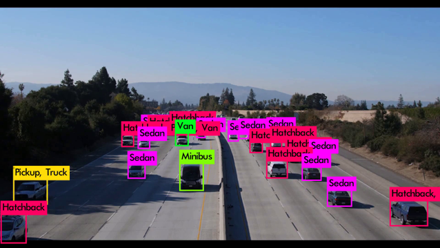

# YOLO_VEH_IPL

This is an extension to [YOLOv2](https://github.com/pjreddie/darknet), including our trained model for vehicle detection on the dataset of NVIDIA AI City Challenge. 

**We strongly encourage to try the latest [YOLOv3 object detector](https://pjreddie.com/darknet/yolo/) instead.**  

## How It Works

We select 4,500 frames uniformly sampled from the dataset of NVIDIA AI City Challenge, where each of them contains 5 to 40 objects. The training data are manually labeled in 8 categories, including sedan, hatchback, bus, pickup, minibus, van, truck and motorcycle. The state-of-the-art object detector, YOLOv2, is chosen by us for training and testing. The pretrained weights are used to initialize the network. 

## Getting Started

### Prerequisites

0. Linux system
1. CUDA and cuDNN

The code has been tested on Ubuntu 16.04 with g++, CUDA 8.0 and cuDNN 6.0. 

### Installing

Download our package and extract all the contents. The trained model (weights) can be downloaded [here](https://drive.google.com/file/d/1VKBZyJ0s2ejx3FWgr-r3iJ-Tu0QFokvd/view?usp=sharing). Follow the instruction in Joseph Redmon's [blog](https://pjreddie.com/darknet/yolov2/) to make and test the trained model. The given bash files provide examples of processing the entire dataset.  

    

### Input/Output Format

For output detection results in text, the format of each line is as follows:

\<frame_id\>,-1,\<xmin\>,\<ymin\>,\<width\>,\<height\>,\<confidence\>,-1,-1,-1,\<class\>

This is similar to the required format of [MOTChallenge](https://motchallenge.net/). The frame ID is 0-based. The confidence is in percentage. 
