# 3_LP_COMP

This is a C++ implementation of low-resolution license plate comparison by bitwise-OR operation.

## Introduction

The license plates are essential to large-scale vehicle re-identification. However, the resolution of the dataset of 2018 NVIDIA AI City Challenge is not sufficient to support automatic license plate recognition, which brings about a major challenge in ICT. Hence, we propose a license plate comparison scheme for low-resolution images. The process of license plate comparison is demonstrated in the figure below.

<div align="center">
    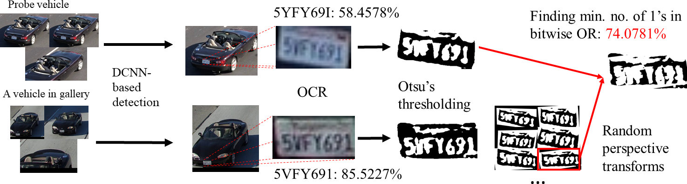
</div>

After license plate detection by DCNN, we can crop each license plate image for comparison. 

<div align="center">
    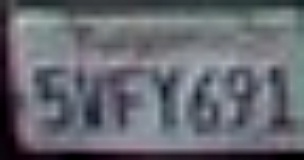
</div>

<div align="center">
    
</div>

All the characters are first segmented based on a vertical histogram that finds gaps between the plate characters. An Optical Character Recognition (OCR) phase analyzes each character independently, which generates the most possible characters and the confidence. If the confidence scores of two license plates are both above a threshold, the recognized characters are considered correct. The license plate comparison loss is thus calculated as the portion of characters that are mismatched.

Otherwise, if either of the license plates fails to be recognized properly, which is common for low-quality images, the cropped images of license plate regions are normalized and segmented into binary images by Otsu’s method for comparison. 

<div align="center">
    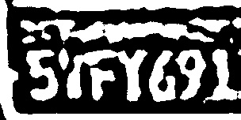
</div>

<div align="center">
    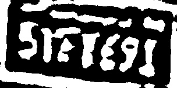
</div>

Because of potential perspective difference between two license plates, we perform 200 random perspective transforms on the gallery image.

<div align="center">
    
</div>

<div align="center">
    
</div>

<div align="center">
    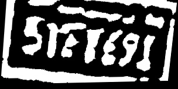
</div>

<div align="center">
    
</div>

<div align="center">
    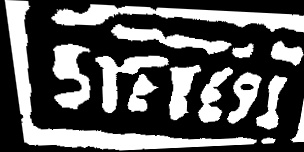
</div>

<div align="center">
    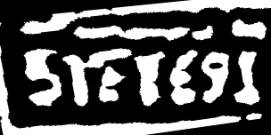
</div>

Each transformed image is compared with the probe image by bitwise OR operation. In this scenario, the license plate comparison loss is proportional to the 1’s in the combined binary image. 

<div align="center">
    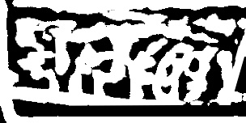
</div>

<div align="center">
    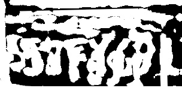
</div>

<div align="center">
    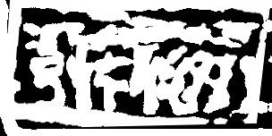
</div>

<div align="center">
    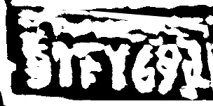
</div>

<div align="center">
    
</div>

<div align="center">
    
</div>

In this example, the last combined image is the one to be chosen for the computation of the license plate comparison loss.


## Coding Structure

1. `./src/` folder: Source code
2. `./data/` folder: Example input files for comparison

## How to Build

1. Download and make the OpenCV library. A tutorial is given [here](https://docs.opencv.org/master/d7/d9f/tutorial_linux_install.html).
2. Compile using g++ in Linux environment. If you are new to g++ compilation with OpenCV, please refer to this [link](http://answers.opencv.org/question/25642/how-to-compile-basic-opencv-program-in-c-in-ubuntu/). In the command window, you can `cd` to the current directory and use the following command to compile our source code, where `bin` is the executable file generated. Note that you may need to add `sudo` at the beginning to grant the admin permission.

```g++ -I/usr/local/include/ -L/usr/local/lib/ -g -o bin ./src/main.cpp -lopencv_core -lopencv_imgproc -lopencv_highgui -lopencv_imgcodecs -lm```

## How to Use

1. For the comparison based on license plate characters using OCR, the user can first process the images by open-source methods, such as [OpenALPR](https://github.com/openalpr/openalpr). If the OCR scores of both license plates are too low, our method can be adopted to process low-resolution images. 
2. Set the configuration parameters in the `main` function at the bottom. 
3. Run the executable file.

```./bin```

### Output Format

The output from the given function is a distance score between two license plates normalized to 0-1. 

## Disclaimer

For any question you can contact [Zheng (Thomas) Tang](https://github.com/zhengthomastang).