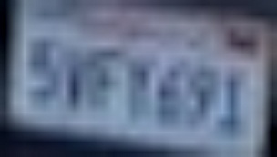
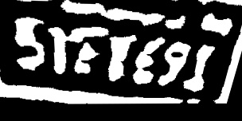
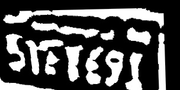
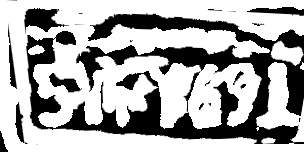
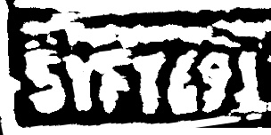

# LP_COMP_IPL

This is an implementation of low-resolution license plate comparison by bitwise-OR operation.

`LP_COMP_IPL` is joint work with Zheng (Thomas) Tang, Gaoang Wang, Hao Xiao, Aotian Zheng, and Prof. Jenq-Neng Hwang from the Information Processing Lab in the Department of Electrical Engineering, University of Washington. 

## How It Works

The license plates are essential to large-scale vehicle re-identification. However, the resolution of the NVIDIA AI City Dataset is not sufficient to support automatic license plate recognition, which brings about a major challenge in ICT. Hence, we propose a license plate comparison scheme for low-resolution images. The process of license plate comparison is demonstrated in the figure below.

    

After license plate detection by DCNN, we can crop each license plate image for comparison. 

    

    

All the characters are first segmented based on a vertical histogram that finds gaps between the plate characters. An Optical Character Recognition (OCR) phase analyzes each character independently, which generates the most possible characters and the confidence. If the confidence scores of two license plates are both above a threshold, the recognized characters are considered correct. The license plate comparison loss is thus calculated as the portion of characters that are mismatched.

Otherwise, if either of the license plates fails to be recognized properly, which is common for low-quality images, the cropped images of license plate regions are normalized and segmented into binary images by Otsu’s method for comparison. 

    

    

Because of potential perspective difference between two license plates, we perform 200 random perspective transforms on the gallery image.

    

    

    

    

    

    

Each transformed image is compared with the probe image by bitwise OR operation. In this scenario, the license plate comparison loss is proportional to the 1’s in the combined binary image. 

    

    

    

    

    

    

In this example, the last combined image is the one to be chosen for the computation of the license plate comparison loss.

## Getting Started

### Prerequisites

0. Windows or Linux system
1. OpenCV

The code has been tested on Ubuntu 14.04 with g++ compiler. 

### Installing

For the comparison based on plate characters using OCR, the user can first process the images by open-source methods, such as [OpenALPR](https://github.com/openalpr/openalpr). If the OCR scores of both license plates are too low, our method can be adopted to process low-resolution images. 

First, compile the source code with g++. When running the code, input the paths of two license plate images to be compared. The user also needs to provide the configuration parameters for adaptive thresholding methods in OpenCV. Besides, the number of random perspective transforms and their range need to be defined. 

### Input/Output Format

The output from the given function is a distance score between two license plates normalized to 0-1. 