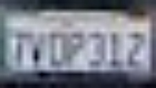

# YOLO_LP_IPL

This is an extension to [YOLOv2](https://github.com/pjreddie/darknet), including our trained model for license plate detection on the dataset of NVIDIA AI City Challenge. 

## How It Works

We train a DCNN model to detect the license plate region in each cropped vehicle image. For each trajectory set, 3 representative views of object instances are selected for license plate recognition. The license plate detector is run on cropped vehicle images and the detected region with the highest score is chosen for comparison. 

## Getting Started

### Prerequisites

0. Linux system
1. CUDA and cuDNN

The code has been tested on Ubuntu 16.04 with g++, CUDA 8.0 and cuDNN 6.0. 

### Installing

Download our package and extract all the contents. The trained model (weights) can be downloaded [here](https://drive.google.com/file/d/1VKBZyJ0s2ejx3FWgr-r3iJ-Tu0QFokvd/view?usp=sharing). Follow the instruction in Joseph Redmon's [blog](https://pjreddie.com/darknet/yolov2/) to make and test the trained model. The given bash files provide examples of processing the entire dataset.   

    

    

    

### Input/Output Format

For input paths of vehicle images in text, the format of each line is as follows:

\<input_vehicle_image_path\>

This text file simply lists all the cropped vehicle images for license plate detection.   

For output detection results in text, the format of each line is as follows:

\<xmin\> \<ymin\> \<width\> \<height\> \<confidence\> \<input_vehicle_image_path\>

The confidence is in percentage. The license plate image(s) can be cropped from each vehicle image based on the detection results. 
